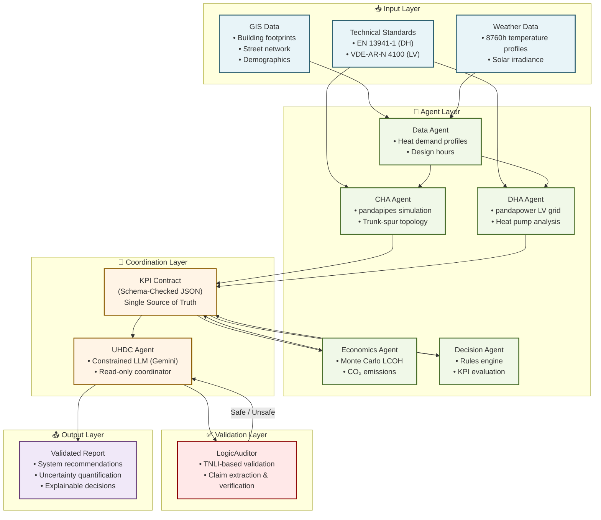
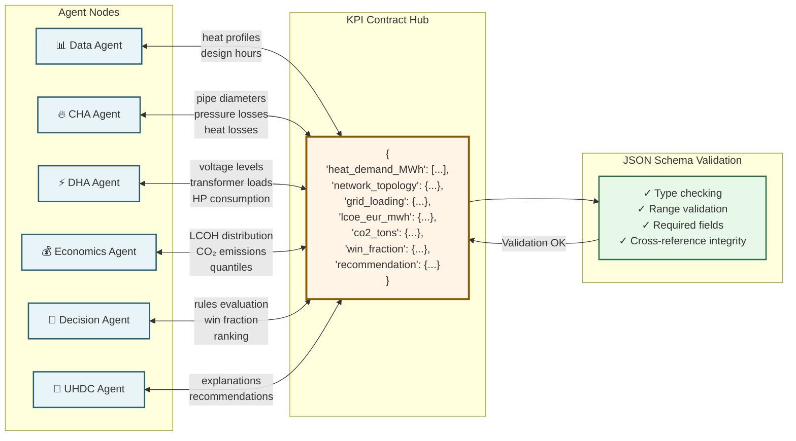
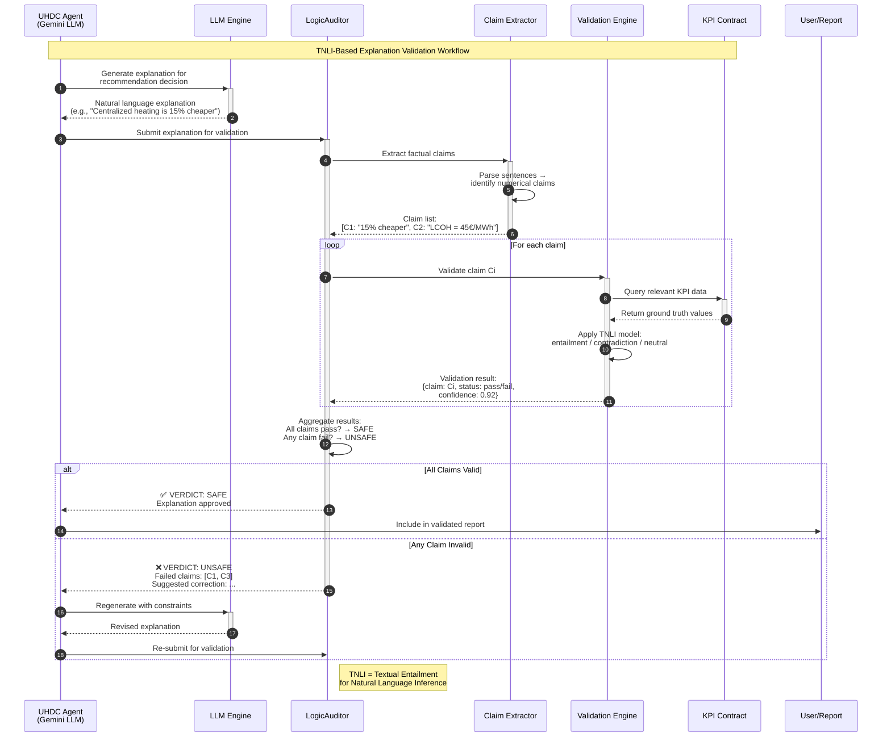
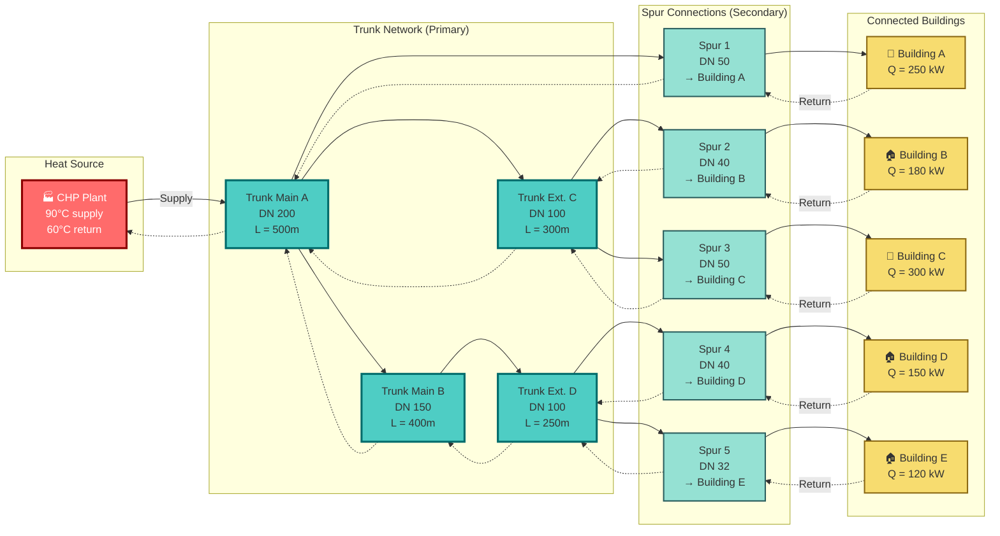
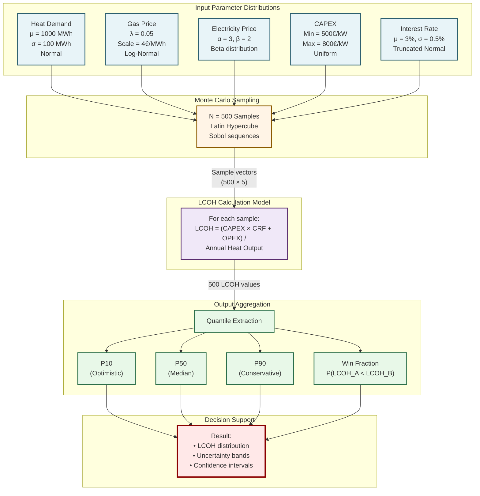
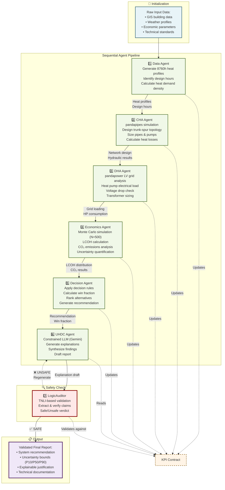

# Branitz2: Multi-Agent Framework for Climate-Neutral Urban Heat Planning
## Publication-Quality Mermaid Diagrams

---

## 1. High-Level System Architecture

**Description:** Shows the complete data flow from raw GIS data through all agents to the final validated report. The LogicAuditor serves as a safety check on the UHDC Agent's LLM-generated explanations.

---

## 2. Multi-Agent Interaction with KPI Contracts

**Description:** Illustrates how all agents communicate through the central KPI Contract, which acts as a schema-checked JSON hub ensuring data consistency and traceability across the multi-agent system.

---

## 3. TNLI Logic Auditor Sequence Diagram

**Description:** Shows the complete validation workflow: the UHDC Agent's LLM generates an explanation, the LogicAuditor extracts factual claims, validates them against the KPI Contract data, and returns a safe/unsafe verdict with justification.

---

## 4. Trunk-Spur Topology Example

**Description:** Visualizes a typical district heating network topology with a CHP plant feeding into trunk mains (high-capacity pipes) with extensions and buildings connected via spur pipes (lower-capacity connections).

---

## 5. Monte Carlo Workflow

**Description:** Illustrates the uncertainty propagation workflow: input parameters are sampled from distributions, fed through the LCOH calculation model, and results are aggregated into quantiles (P10/P50/P90) and win fractions for decision-making.

---

## 6. Zero-to-Hero Pipeline Flowchart

**Description:** The complete end-to-end pipeline showing sequential agent execution from raw data input through to the final validated report, with the LogicAuditor ensuring explanation quality at the final stage.

---

## Summary

This document contains six publication-quality Mermaid diagrams for the Branitz2 thesis presentation:

| # | Diagram | Purpose |
|---|---------|---------|
| 1 | **High-Level System Architecture** | Overview of data flow from inputs to validated output |
| 2 | **Multi-Agent Interaction with KPI Contracts** | Central hub architecture showing agent communication |
| 3 | **TNLI Logic Auditor Sequence Diagram** | Step-by-step validation workflow |
| 4 | **Trunk-Spur Topology Example** | Visual network topology with color-coded pipes |
| 5 | **Monte Carlo Workflow** | Uncertainty propagation from distributions to quantiles |
| 6 | **Zero-to-Hero Pipeline Flowchart** | Complete sequential pipeline with feedback loop |

### Design Principles Applied

- **Academic styling**: Subdued, professional color palettes
- **Clear hierarchy**: Visual distinction between layers and components
- **Consistent notation**: Standardized symbols and labels
- **Information density**: Appropriate detail for publication quality
- **Standards compliance**: References to EN 13941-1 and VDE-AR-N 4100
